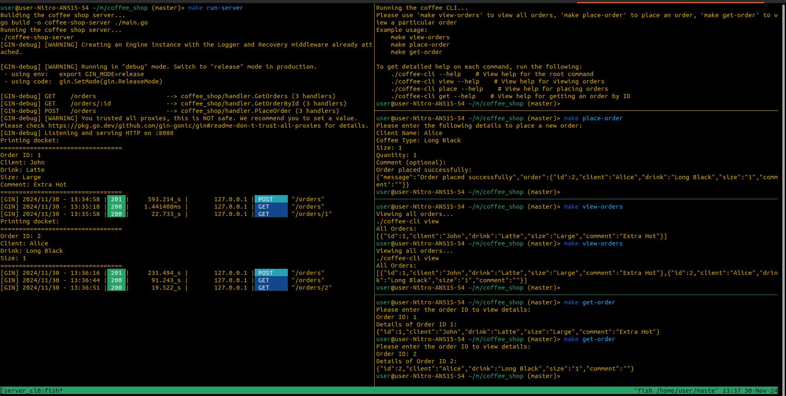

# Coffee Shop CLI

---

## Table of Contents

- [Coffee Shop CLI](#coffee-shop-cli)
  - [Table of Contents](#table-of-contents)
  - [Overview](#overview)
  - [Setup Instructions](#setup-instructions)
    - [Clone the repository](#clone-the-repository)
    - [Install Go Dependencies](#install-go-dependencies)
    - [Build the server and client binaries](#build-the-server-and-client-binaries)
  - [Usage](#usage)
    - [Commands](#commands)
    - [Examples](#examples)
      - [Start the Server](#start-the-server)
      - [Start the Client](#start-the-client)
      - [Example Workflow: Placing an Order and Viewing It](#example-workflow-placing-an-order-and-viewing-it)
    - [Example Screenshot](#example-screenshot)
  - [Makefile Commands](#makefile-commands)
  - [Help Section](#help-section)
  - [Dependencies](#dependencies)

## Overview

This project is a simple coffee shop system where clients can place orders and view existing orders via a command line interface (CLI). The system is built with Go, using `Gin` for the HTTP server, `Cobra` for CLI commands, and `Viper` for configuration management.

- **View all orders**
- **Place a new order**
- **Get order details by ID**

## Setup Instructions

To get started with this project, follow these steps:

### Clone the repository

```bash
git clone <git-url>
cd coffee-shop
```

### Install Go Dependencies

Before running the CLI, ensure all dependencies are installed using Go’s module system.

```bash
make install-deps
```

### Build the server and client binaries

The `make all` command will compile the server (`coffee-shop-server`) and client (`coffee-cli`) binaries.

```bash
make all
```

## Usage

The Coffee Shop CLI provides various commands for managing coffee orders. Below are the available commands and their descriptions.

### Commands

1. **View all orders**  
   This command fetches and displays all orders from the server.

   ```bash
   make view-orders
   ```

2. **Place a new order**  
   This command allows you to place a new coffee order by entering the following details:
   - Client Name
   - Coffee Type
   - Size
   - Quantity
   - Optional comment

   Example:

   ```bash
   make place-order
   ```

3. **Get order by ID**  
   This command allows you to get details of a specific order by entering its respective id:
   - Order ID

   Example:

   ```bash
   make get-order
   ```

### Examples

#### Start the Server

```bash
make run-server
```

#### Start the Client

```bash
make run-client
```

#### Example Workflow: Placing an Order and Viewing It

1. **Place an Order**  
   To place a new order, run the following command. The CLI will prompt you to enter the required details:

   ```bash
   make place-order
   ```

   Example Input:

   ```bash
   Client Name: John 
   Coffee Type: Latte
   Size: Large
   Quantity: 2
   Comment: Extra hot
   ```

2. **View All Orders**  
   After placing an order, you can view all the orders placed by running:

   ```bash
   make view-orders
   ```

3. **Get Details of a Specific Order by ID**  
   To get details of a particular order, use the `get-order` command:

   ```bash
   make get-order
   ```

   You will be prompted to enter the order ID, and the details will be displayed.

### Example Screenshot



## Makefile Commands

The Makefile provides the following commands:

- **build-server**: Builds the server binary (`coffee-shop-server`).
- **build-client**: Builds the client binary (`coffee-cli`).
- **run-server**: Builds and runs the coffee shop server.
- **run-client**: Builds and runs the coffee CLI.
- **clean**: Removes build artifacts.
- **install-deps**: Installs Go dependencies.
- **view-orders**: Displays all orders.
- **place-order**: Prompts the user to place a new order.
- **get-order**: Prompts the user to fetch order details by ID.
- **help**: Displays the help section with command usage.

## Help Section

For detailed help on each command, you can use the `--help` flag on the cli executable. Example:

```bash
./coffee-cli view --help   # Help for viewing all orders
./coffee-cli place --help  # Help for placing a new order
./coffee-cli get --help    # Help for getting details of a specific order
```

To view help for the entire CLI, run:

```bash
./coffee-cli --help
```

This will display all the available commands and their descriptions.

## Dependencies

- Go 1.18 or higher
- Gin for custom routing
- Cobra CLI framework
- Viper for configuration management
- HTTP server for handling API requests (running at `http://localhost:8080`)
